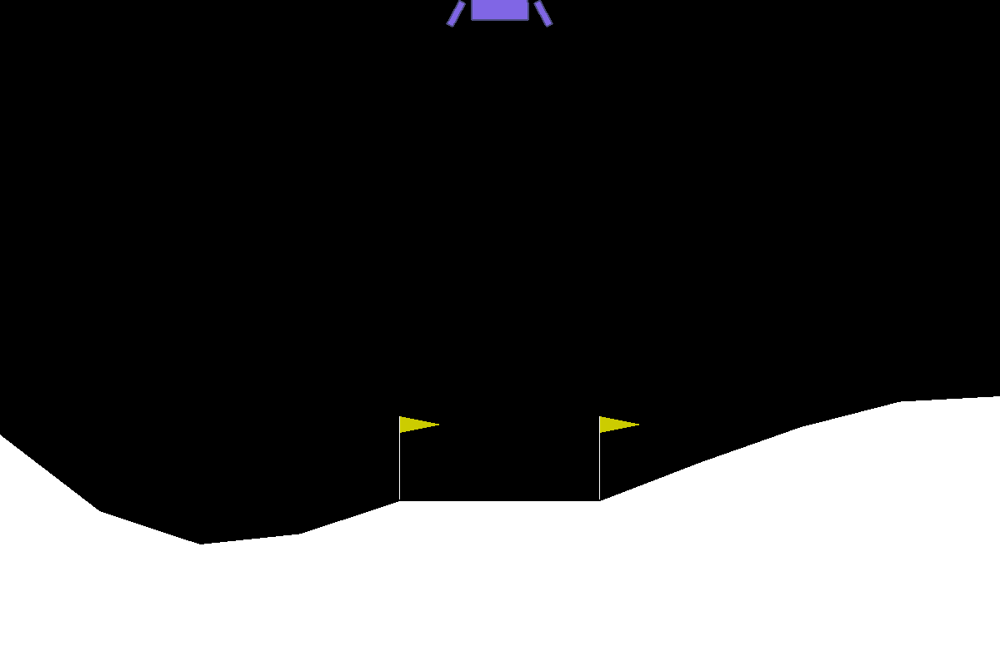

# PPO solution for lunar lander from scratch

### Purpose
Well, I am studying LLM and it has an important RL step. My RL is a little rusty, so I set up some codes here to refresh myself. 

It heavily follows [Hung-Yi Lee's lecture](https://speech.ee.ntu.edu.tw/~hylee/ml/2023-spring.php), [openai's baseline](https://github.com/openai/baselines/tree/master/baselines) (although in a much simplified form), and [this](https://github.com/nikhilbarhate99/PPO-PyTorch/blob/master/train.py) and [this](https://github.com/PacktPublishing/Deep-Reinforcement-Learning-Hands-On) github pages.

Lee's lecture is excellent, especially the way he goes from policy gradient to actor-critic framework. Strongly suggest start from there.

For papers, the main references on Proximal Policy Optimization (PPO) and Generalized Advantage Estimation (GAE) are attached.

### Main files
1. debug-consistent-routines.ipynb: the main file for debugging scripts and classes.

2. full-run.ipynb: the main file for running the training. This is how you would like to run the codes in general.

### Scripts
1. env.py: wrapper for gym env, which allows users to normalize the reward and the action space for better convergence in the training. **Normalizing the reward** for the lunar lander is critical. It also allows the user to discretize the action space for the continuous case.

2. policy.py: implement the fully connected network as actor and critic. One can choose whether the actor and critic share parts of the network or not. In addition, one can also drop the critic, i.e. use pure policy gradient method. For continuous action space, the output distribution for action space is diag Gaussian, and for discrete action space, it is categorical.

3. agent.py: PPO agent that carries the policy and implements the step and train methods.

4. runner.py: runner that couples the agent and event. The main purpose is to prepare the info dictionary that the agent can use for training. The info dictionary contains the states, returns, advantages, actions, log probabilities and estimated values V(s). The notations used in computing the advantages are [s_t, a_t, r_t, s_t+1], where s_t is the state at the current step, a_t is the action taken, r_t is the reward received, and s_t+t is the next state.

5. trainer.py: the usual trainer that calls the runner then the agent for learning, and records some outputs for plotting.

### Technical notes
1. For this specific example, I only need to scale the reward by multiplying 0.01. I didn't scale the advantages by removing the mean then scale to advantages to std 1.0. I think in a more general case, one needs to rescale the advantages as many authors suggest.

2. Exploration is done implicitly by using distribution.sample() for both the discrete and continuous cases. Other examples may be better off to tune this explicitly.

3. Main parameters used

| Parameter | Value |
| --------- | ----- |
| learning rate lr | 1e-3 |
| batch size | 1024 |
| hidden layer nodes | 64 |
| number of off policy runs K | 10 |
| clipped threshold eps | 0.2 |
| discount rate gamma | 0.99 |
| GAE lambda | 0.95 |
| initial std for continuous case | 1.0 |

### Things to do
1. When one discretizes the continous case, it may be useful to keep the order by following Tang and Agrawal's paper, which is also attached.

2. Vectorize the environment may speed up a lot. I tried putting the network on GPU but the speed up is very limited. It alters too frequently between GPU and CPU and the network is a fully connected one and pretty small. So GPU may not be quite useful here.

### Results
For random actions, it looks like:

After training, it can successfully land:

### Libraries used
* gym==0.21.0
* jupyter==1.0.0
* python==3.9.7
* pytorch==2.0.0
* imageio==2.31.1
* tqdm==4.65.0
* libffi==3.3 (this is to make jupyter work on my mac)

NOTE: I used a somewhat old version of gym, the newer one crashes on my mac.
